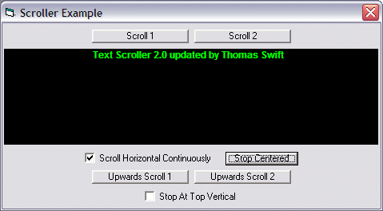



## A Scroller Version 2 \- Smoothly scrolls text in a picturebox

### Description

It can scroll right to left or bottom to top, stop at top or stop centered, scroll and stop or Scroll Continuously and background, text colors & fonts are all customizable. It uses bitblt to do the drawing so its flickerless. This control is a updated version of http://www.Planet-Source-Code.com/vb/scripts/ShowCode.asp?txtCodeId=14967&lngWId=1 that I modified & updated for Almost Real Jukebox.
 
### More Info
 

             |
---                |---
**Submitted On**   |2004-10-23 20:07:50
**By**             |[Thomas Swift](https://github.com/Planet-Source-Code/PSCIndex/blob/master/ByAuthor/thomas-swift.md)
**Level**          |Intermediate
**User Rating**    |5.0 (15 globes from 3 users)
**Compatibility**  |VB 6\.0
**Category**       |[Custom Controls/ Forms/  Menus](https://github.com/Planet-Source-Code/PSCIndex/blob/master/ByCategory/custom-controls-forms-menus__1-4.md)
**World**          |[Visual Basic](https://github.com/Planet-Source-Code/PSCIndex/blob/master/ByWorld/visual-basic.md)
**Archive File**   |[A\_Scroller18095310232004\.zip](https://github.com/Planet-Source-Code/thomas-swift-a-scroller-version-2-smoothly-scrolls-text-in-a-picturebox__1-56893/archive/master.zip)

